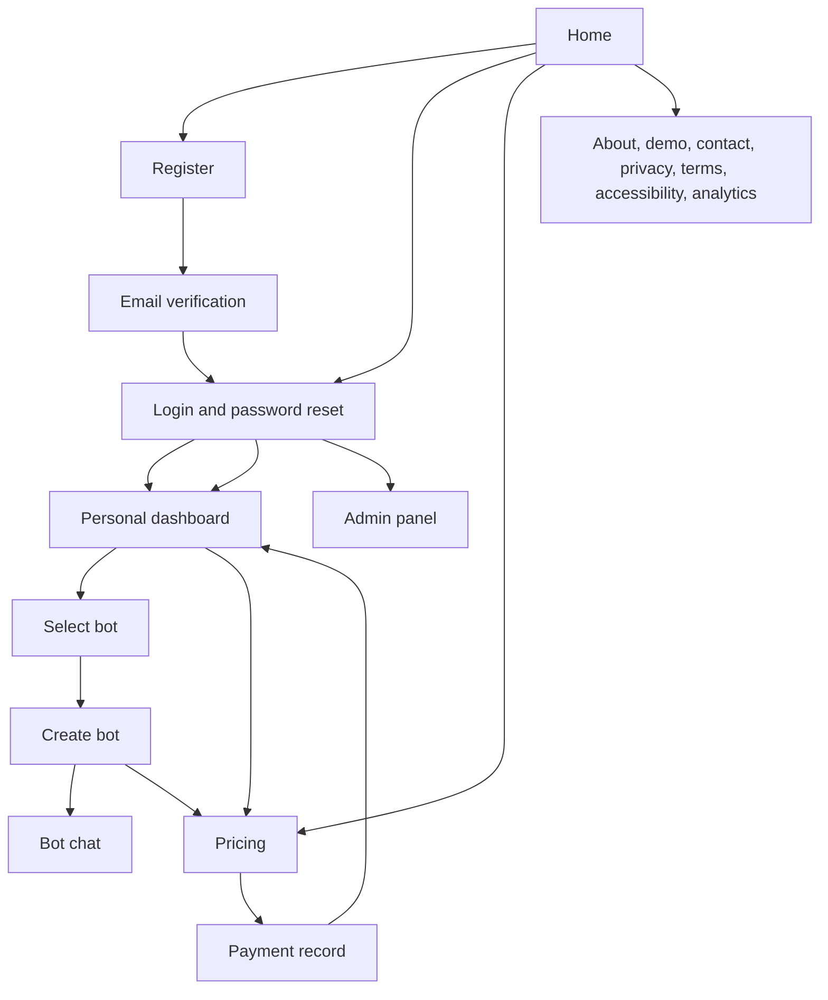
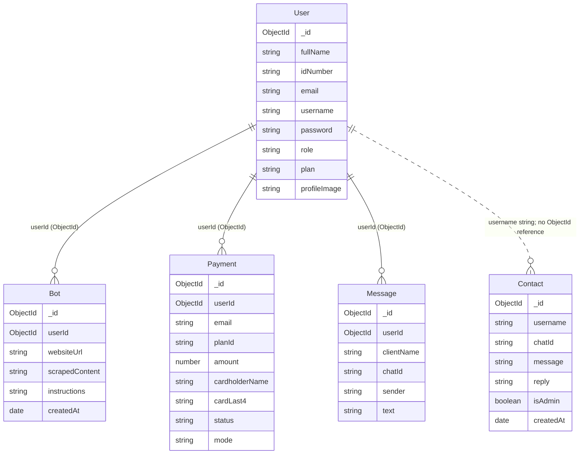

# Botify Project Design

## Screen flow

Screen files are under `public/` and `public/pages/`. The diagram shows the principal user flow; public information pages are grouped together.

## Active API routes

The route paths below are mounted by `server.js`. `Bearer token` means the request must include an authenticated token. `Admin` means both authentication and the admin role are required.

| Method | URL | Access | Purpose |
| --- | --- | --- | --- |
| POST | `/api/send-otp` | Public | Send registration verification code |
| POST | `/api/register-verify` | Public | Verify code and create account |
| POST | `/api/register` | Public | Basic account registration |
| POST | `/api/login` | Public | Start login |
| POST | `/api/login-verify` | Public | Verify login code |
| POST | `/api/password-reset/request` | Public | Request password reset code |
| POST | `/api/password-reset/confirm` | Public | Set a new password |
| GET | `/api/users/count` | Admin | Count users |
| GET | `/api/users` | Admin | List users |
| POST | `/api/users/me/profile-image` | Bearer token | Upload profile image |
| GET | `/api/messages` | Admin | List support messages |
| GET | `/api/user-messages` | Bearer token | List current user's support messages |
| POST | `/api/contact` | Bearer token | Create support message |
| POST | `/api/reply` | Admin | Reply to a support conversation |
| GET | `/api/bots` | Bearer token | List owned bots |
| GET | `/api/bots/quota` | Bearer token | Check bot quota |
| GET | `/api/bots/:botId` | Bearer token | Read a bot |
| POST | `/api/bots/create-bot` | Bearer token | Scrape a website and create a bot |
| PUT | `/api/bots/:botId` | Bearer token | Update bot instructions |
| DELETE | `/api/bots/:botId` | Bearer token | Delete a bot |
| POST | `/api/bots/:botId/chat` | Public | Send a message to a bot |
| POST | `/api/payments` | Bearer token | Save a payment/plan record and update the plan |

`routes/chatRoutes.js` and `routes/analyticsRoutes.js` exist in the repository but are not mounted by `server.js`; their endpoints are therefore not part of the active API listed above.

## Database schemas

- `User` has a one-to-many reference to `Bot`, `Payment`, and `Message` through `userId` where the field is populated.
- `Contact` associates conversations by the `username` string and `chatId`; it does not currently store a `User` ObjectId reference.
- `Bot.userId` is optional because admin-created bots are not assigned to a regular user.
- `Message` has a Mongoose schema, but the routes in `chatRoutes.js` are not mounted by the current server entry point.
- `models/Lead.js` is empty and does not define a database entity.